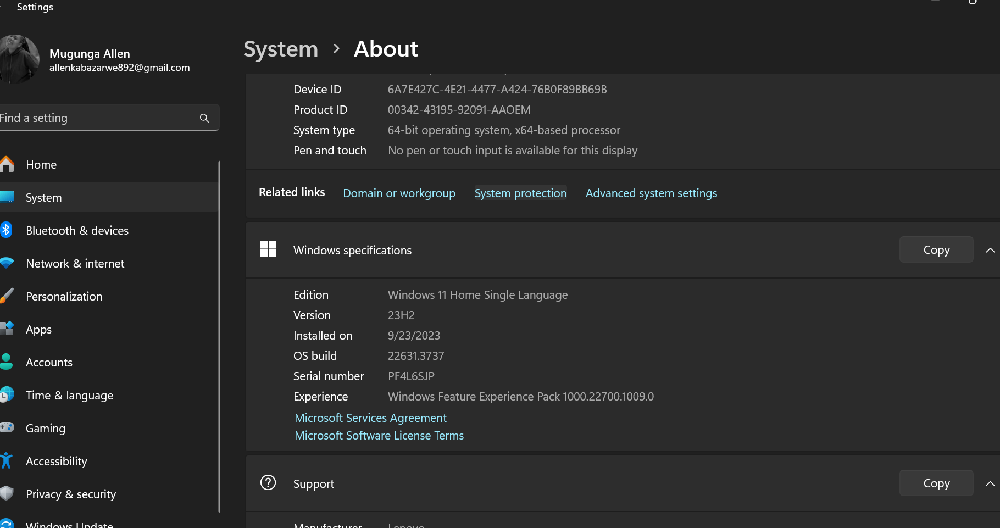

# Dev_Setup
Setup Development Environment

#Assignment: Setting Up Your Developer Environment

#Objective:
This assignment aims to familiarize you with the tools and configurations necessary to set up an efficient developer environment for software engineering projects. Completing this assignment will give you the skills required to set up a robust and productive workspace conducive to coding, debugging, version control, and collaboration.

#Tasks:

1. Select Your Operating System (OS):
   Choose an operating system that best suits your preferences and project requirements. Download and Install Windows 11. https://www.microsoft.com/software-download/windows11
   Upgrade by launching Setup on the media while running Windows 10. You will have the option to: 

a. Perform a Full Upgrade, which keeps personal files (including drivers), apps, and Windows Settings. This is the default experience and is the one that Installation Assistant uses.

b. Keep Data Only will keep personal files (including drivers) only, not apps and not Windows Settings.
 
c. Clean Install will install Windows 11 and keep nothing from the Windows 10 installation. For more info, see Give your PC a Fresh Start.

Boot from media to launch Setup. This path is a clean install and will not retain previous files or settings. For more info, see Give your PC a Fresh Start.

Important: You should verify that your device meets minimum system requirements before you choose to boot from media, because it will allow you to install Windows 11 if you have at least TPM 1.2 (instead of the minimum system requirement of TPM 2.0), and it will not verify that your processor is on the approved CPU list based on family and model of processor.

2. Install a Text Editor or Integrated Development Environment (IDE):
   Select and install a text editor or IDE suitable for your programming languages and workflow. Download and Install Visual Studio Code. https://code.visualstudio.com/Download
   Download the VS Code file from the Official Website.
Execute the download file.
Accept the Terms & Conditions.
Click on the Install button.
Wait for the installation to complete.
Click on the Launch button to start it.

3. Set Up Version Control System:
   Install Git and configure it on your local machine. Create a GitHub account for hosting your repositories. Initialize a Git repository for your project and make your first commit. https://github.com

4. Install Necessary Programming Languages and Runtimes:
  Instal Python from http://wwww.python.org programming language required for your project and install their respective compilers, interpreters, or runtimes. Ensure you have the necessary tools to build and execute your code.

5. Install Package Managers:
   If applicable, install package managers like pip (Python).

6. Configure a Database (MySQL):
   Download and install MySQL database. https://dev.mysql.com/downloads/windows/installer/5.7.html

7. Set Up Development Environments and Virtualization (Optional):
   Consider using virtualization tools like Docker or virtual machines to isolate project dependencies and ensure consistent environments across different machines.

8. Explore Extensions and Plugins:
   Explore available extensions, plugins, and add-ons for your chosen text editor or IDE to enhance functionality, such as syntax highlighting, linting, code formatting, and version control integration.

9. Document Your Setup:
    Create a comprehensive document outlining the steps you've taken to set up your developer environment. Include any configurations, customizations, or troubleshooting steps encountered during the process. 
Developer Environment Setup Documentation
Overview
This document outlines the steps taken to set up a developer environment on a Windows 11 Home Single Language system, including the installation and configuration of essential tools, customizations made to optimize productivity, and troubleshooting steps encountered along the way.

System Specifications
Operating System: Windows 11 Home Single Language
Processor: 12th Gen Intel(R) Core(TM) i7-1255U 1.70 GHz
RAM: 16.0 GB (15.7 GB usable)
Tools and Software
1. Version Control
Git
Installation:

Download the Git installer from Git for Windows.
Run the installer and follow the setup instructions.
Use default settings unless specific customization is required.
Configuration:

bash
git config --global user.name "Your Name"
git config --global user.email "your.email@example.com"
Verification:
Open Command Prompt or PowerShell and run:

bash
git --version

2. Text Editor/IDE
Visual Studio Code
Installation:

Download the Visual Studio Code installer from VS Code.
Run the installer and follow the setup instructions.
Use default settings unless specific customization is required.
Extensions:

Python
Prettier - Code formatter
GitLens — Git supercharged
ESLint
Settings Sync:

Sign in to your GitHub or Microsoft account to sync settings and extensions across devices.

3. Programming Languages
Python
Installation:

Download the Python installer from python.org.
Run the installer and ensure "Add Python to PATH" is checked.
Follow the setup instructions.
Verification:
Open Command Prompt or PowerShell and run:

python --version
pip --version
Node.js
Installation:

Download the Node.js installer from nodejs.org.
Run the installer and follow the setup instructions.
Use default settings unless specific customization is required.
Verification:
Open Command Prompt or PowerShell and run:

bash
node -v
npm -v

4. Containerization
Docker Desktop
Installation:

Download the Docker Desktop installer from Docker.
Run the installer and follow the setup instructions.
Restart your computer if prompted.
Configuration:

Enable WSL 2 (Windows Subsystem for Linux 2) integration.
Set Docker to start on boot (optional).
Verification:
Open Command Prompt or PowerShell and run:

bash
docker --version
docker-compose --version
5. Database
PostgreSQL
Installation:

Download the PostgreSQL installer from PostgreSQL.
Run the installer and follow the setup instructions.
Use default settings unless specific customization is required.
Starting the service:

The PostgreSQL service should start automatically after installation. If not, start it from the Services app.
Basic configuration:
Open the SQL Shell (psql) and set the password for the postgres user:

sql
ALTER USER postgres PASSWORD 'newpassword';
Verification:
Open Command Prompt or PowerShell and run:

bash
psql -U postgres -W
Customizations
Terminal Configuration
Windows Terminal
Installation:

Download and install Windows Terminal from the Microsoft Store.
Customizations:

Set default profile to Command Prompt, PowerShell, or WSL.
Customize appearance and color scheme from the Settings menu.
Shell Configuration
Windows Subsystem for Linux (WSL)
Installation:

Enable WSL feature:
powershell
wsl --install
Install a Linux distribution from the Microsoft Store (e.g., Ubuntu).
Configuration:

Set default WSL version to WSL 2:
powershell
wsl --set-default-version 2
Zsh and Oh My Zsh (within WSL)
Installation:

bash
sudo apt-get update
sudo apt-get install zsh
sh -c "$(curl -fsSL https://raw.githubusercontent.com/ohmyzsh/ohmyzsh/master/tools/install.sh)"
Set Zsh as default shell:

bash
chsh -s $(which zsh)
Custom Theme and Plugins:

Theme: agnoster
Plugins: git, zsh-autosuggestions, zsh-syntax-highlighting
Code Formatting and Linting
Prettier and ESLint for JavaScript
Installation:

bash
npm install -g prettier eslint
Basic Configuration:

.prettierrc
json
{
  "singleQuote": true,
  "trailingComma": "all"
}
.eslintrc.json
json
{
  "env": {
    "browser": true,
    "es6": true,
    "node": true
  },
  "extends": "eslint:recommended",
  "parserOptions": {
    "ecmaVersion": 12,
    "sourceType": "module"
  },
  "rules": {
    "indent": ["error", 2],
    "linebreak-style": ["error", "unix"],
    "quotes": ["error", "single"],
    "semi": ["error", "always"]
  }
}
Troubleshooting Steps
Common Issues and Solutions
Git Configuration Issues
Problem: Unable to set global Git configuration.
Solution:
Open Command Prompt or PowerShell with administrative privileges and run:
bash
git config --system core.editor "code --wait"
Python Package Installation Errors

Problem: Permissions error when installing packages.
Solution:
Open Command Prompt or PowerShell with administrative privileges and run:
bash
pip install package-name
Docker Desktop WSL 2 Backend Issues
Problem: Docker Desktop fails to start due to WSL 2 backend issues.
Solution:
Ensure WSL 2 is installed and set as default.
Restart Docker Desktop and your computer.
PostgreSQL Authentication Failed
Problem: Authentication failed for user postgres.
Solution:
Open the SQL Shell (psql) and run:
sql
ALTER USER postgres PASSWORD 'newpassword';

Conclusion
By following the above steps, a comprehensive developer environment has been set up on a Windows 11 Home Single Language system, complete with essential tools, configurations, and troubleshooting tips. This setup is intended to streamline development workflows and enhance productivity. Regular updates and maintenance of the tools and configurations are recommended to keep the environment optimized and secure.
#Deliverables:
- Document detailing the setup process with step-by-step instructions and screenshots where necessary.
- A GitHub repository containing a sample project initialized with Git and any necessary configuration files (e.g., .gitignore).
- A reflection on the challenges faced during setup and strategies employed to overcome them.

#Submission:
Submit your document and GitHub repository link through the designated platform or email to the instructor by the specified deadline.

#Evaluation Criteria:**
- Completeness and accuracy of setup documentation.
- Effectiveness of version control implementation.
- Appropriateness of tools selected for the project requirements.
- Clarity of reflection on challenges and solutions encountered.
- Adherence to submission guidelines and deadlines.

Note: Feel free to reach out for clarification or assistance with any aspect of the assignment.
